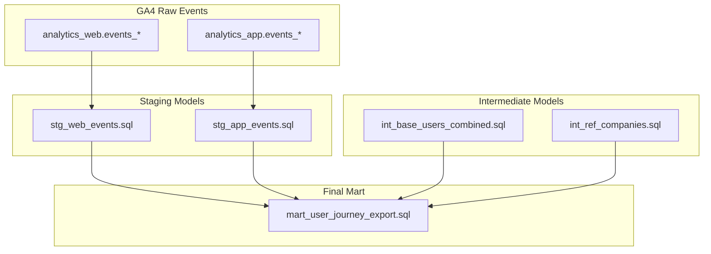

# user-journey-analytics-pipeline


This repository contains a complete end-to-end data pipeline built with **dbt** and **BigQuery**, designed to track and analyze user interactions across mobile apps and web portals. It shows a professional-grade architecture for extracting behavioral patterns, enriching with external metadata, and powering campaign exports.

---

##  Objective

To build a robust data pipeline that:
- Unifies app and web event tracking (GA4)
- Enriches user profiles with metadata and external references
- Categorizes behavioral journeys (claims, quotes, interactions)
- Exports a clean dataset for analytics and user satisfaction campaigns

---

## Architectural Overview

 [View architecture diagram](./docs/architecture.md)



---

##  Project Structure

```bash
.
├── models/
│   ├── staging/
│   │   ├── stg_app_events.sql
│   │   └── stg_web_events.sql
│   ├── intermediate/
│   │   ├── int_base_users_combined.sql
│   │   └── int_ref_companies.sql
│   └── marts/
│       ├── mart_user_journey_export.sql
│       └── schema.yml
├── docs/
│   ├── architecture.md
│   └── mapping-user-events.md
└── dbt_project.yml
```

---

## Data Tests

Implemented in `schema.yml`:
- `not_null` test on `user_ref_id`

---

## Tech Stack

- **dbt**: Data transformation and modeling
- **BigQuery**: Data warehouse and compute engine
- **Mermaid.js**: Documentation diagrams
- **GitHub**: Version control & sharing

---

## Author & Notes

This project was anonymized and restructured based on an fictive project, for the purpose of portfolio presentation. All identifiers, domains, and companies are fals.

---

##  Related

- [docs/mapping-user-events.md](./docs/mapping-user-events.md) — GA4 & Firebase event mapping (anonymized)
