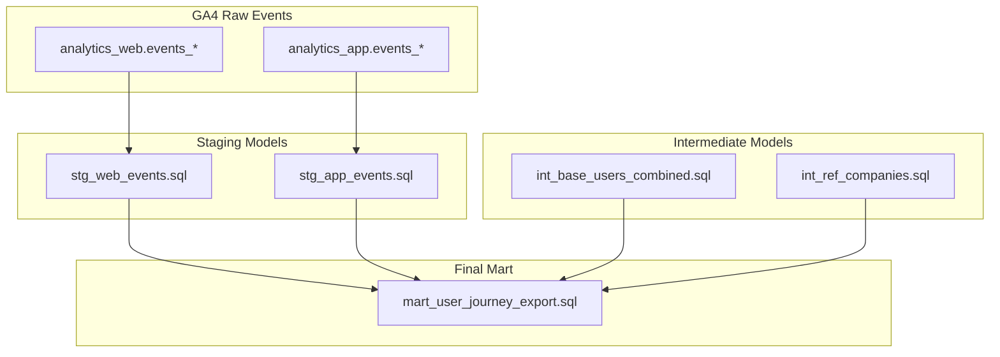

# Architecture - User Journey Analytics Pipeline

This diagram presents the overall data flow from raw GA4 sources to the final export model, including staging, intermediate processing, and reference enrichment.

---

### Data Flow Summary

- **GA4 Web & App**: Raw event data ingested from GA4 export tables
- **Staging Layer**: Filters and aggregates key user interactions (sessions, claims, quotes…)
- **Intermediate Layer**: Combines user metadata and external references (companies)
- **Mart Layer**: Final export used for analysis or campaign targeting
