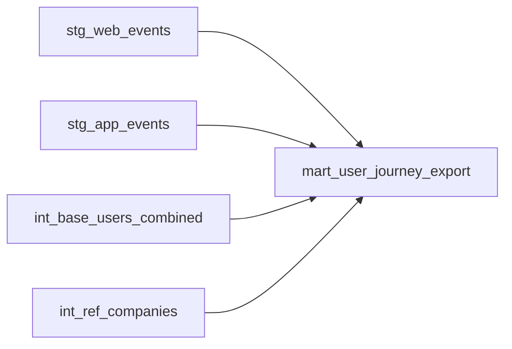

# dbt Model Dependencies

---

This diagram illustrates how each dbt model feeds into the final `mart_user_journey_export.sql` model.
- **Staging models** prepare the raw GA4 data
- **Intermediate models** enrich user profiles and add company info
- **Final mart** combines everything for analytics and campaign readiness
